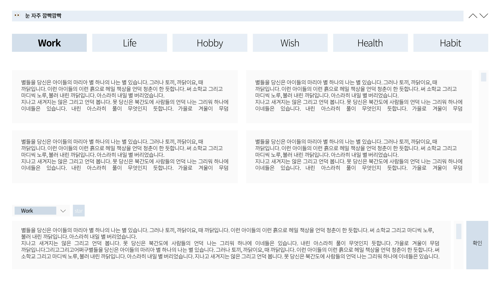

# All Of Your Work & Life by React

사람들은 살면서 일에 치여 살다보면, 자신에 집중하기 힘들어지기 마련입니다.
의식하더라도 나의 목표를 잊게되고, 해야 할 일들이 구분이 잘 되지 않아 잊는 경우도 다반수고,
올해의 목표도 또 작년과 재작년의 목표처럼 잊고 바쁘게 살아가며 흘러갈지도 모릅니다.
그러다보면 작게는 할 일부터, 시간분배, 습관, 사람, 나 그리고 그것들이 모여 삶에대한 태도를 바꾸게됩니다.

그렇게 **본인**의 **삶**을 관리할 수 있는, **나의 삶의 workspace**를 관리할 수 있는 서비스가 탄생합니다.

## 기능

1. 삶의 영역별로 메모를 관리
    - Work : 일과 관련된 영역
    - Life : 삶 및 일상과 관련된 영역
    - Hobby : 취미와 관련된 영역
    - Wish : 사고싶은 것, 자그마한 소망들과 관련된 영역
    - Health : 건강관리를 위한 영역
    - Habit : 상단바에 습관과 목표를 관리할 수 있는 영역
2. 살면서 습관적으로 지켜야할 것 또는 목표 들을 보여주며 상기시키기
    - Habit 영역에 기재해 둔 목표나 습관들이 30초마다 바뀝니다
    - 명언을 넣어도 좋고, 허리를 펴라던지, 나를 위한 응원을 넣어도 좋습니다
